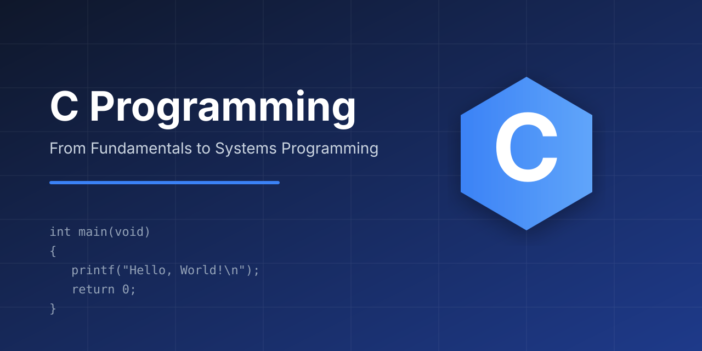

<p align="center">
  
</p>

---

<p align="center">


</p>

## Resumo

Repositório de estudos sobre a linguagem C, com documentação, exercícios e projetos práticos.

O objetivo é aprender C desde os fundamentos até técnicas de programação de sistemas.


## Sumário

- **Documentação (índice):** [docs/README.md](docs/README.md)
- **Guia completo de C:** [docs/guia-completo-c.md](docs/guia-completo-c.md)
- **Exemplos por nível:** [examples-c/README.md](examples-c/README.md)
- **Exercícios:** [exercises/](exercises/)
- **Projetos:** [projects/](projects/)
- **Código-fonte:** [src/](src/) e [include/](include/)
- **Build:** `Makefile`
- **Licença:** MIT


## Começando (rápido)

Compilar um arquivo C simples:

```bash
gcc -Wall -Wextra -std=c17 arquivo.c -o arquivo
./arquivo
```

Compilar com avisos e debug recomendado:

```bash
gcc -Wall -Wextra -Wpedantic -std=c17 -O0 -g main.c -o main
./main
```


## Estrutura (visão rápida)

- `docs/` — documentação e notas (índice em `docs/README.md`)
- `exercises/` — exercícios por tópico (01-basics, 02-control-flow, ...)
- `projects/` — projetos maiores e exemplos práticos
- `src/`, `include/` — código reutilizável e headers


## Roadmap</br>

- Fundamentos → Controle de fluxo → Funções → Ponteiros → Estruturas → I/O → Sistemas


## Contribuição

1. Fork
2. `git checkout -b feat/minha-melhoria`
3. Commit e push
4. Abra um Pull Request


## Licença

Distribuído sob a licença MIT.
